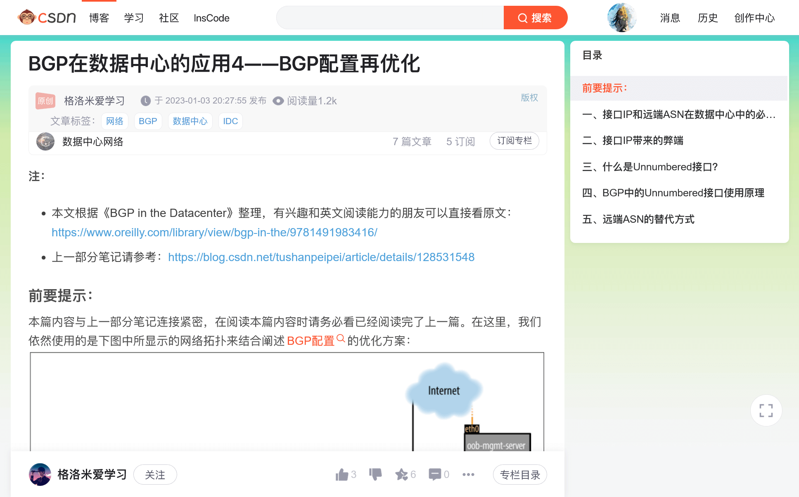
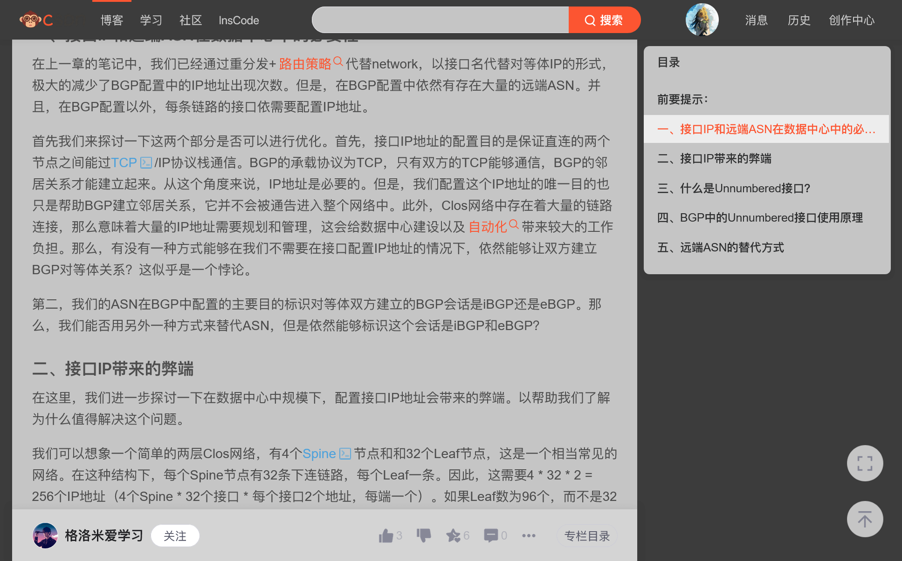

# Pure CSDN

A usercss script for CSDN purification and optimization of reading experience.

## Screenshot

## Installnation

1. Install extension `Stylus`.

2. Click the following badge:

## Features

- [x] Remove useless elements
- [x] Auto dark mode
- [x] Responsive layout
- [x] Adaptive TOC (Table of Contents) layout
- [x] Border radius customize support
- [ ] Reversed dark mode text color

Things that will not change:

- Only support blog page
- Will not support some complex styles (I am not a heavy CSDN user)

## License

This project is licensed under the GPL 3.0 License.
